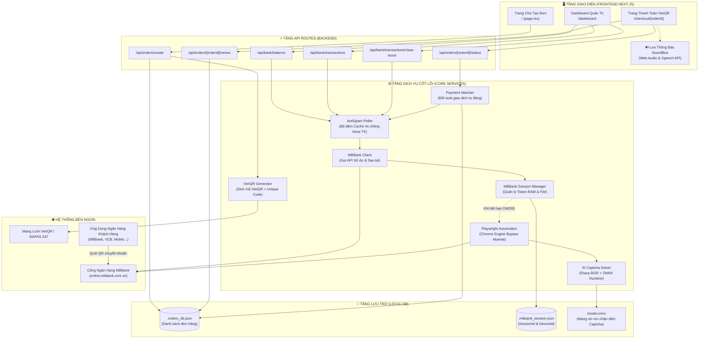
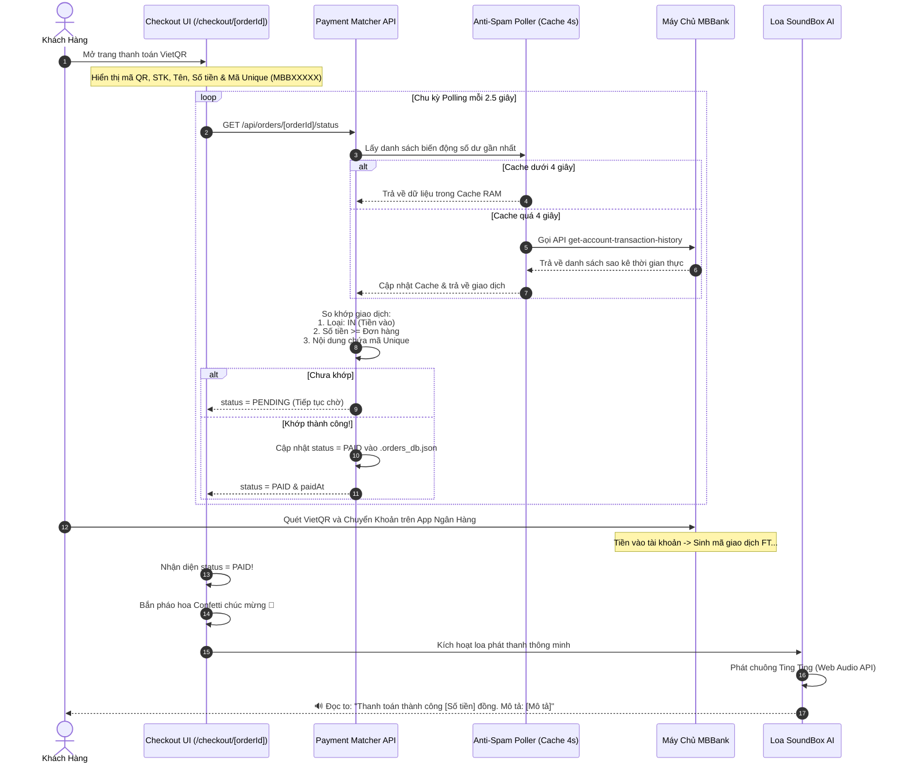
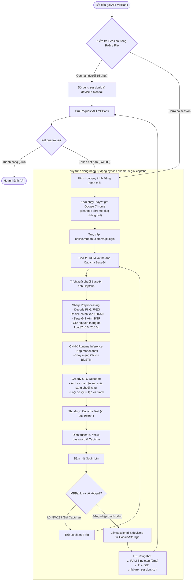

# 🏦 Cổng Thanh Toán Tự Động MBBank & VietQR (Auto-Banking Gateway)

Hệ thống cổng thanh toán trực tuyến tự động hóa 100% qua ngân hàng **MBBank** và chuẩn chuyển khoản **VietQR (NAPAS 24/7)**, tích hợp trí tuệ nhân tạo **AI ONNX Solver** giải mã Captcha tự động, bộ đệm **Anti-Spam Poller**, loa phát thanh thông báo giọng nói **SoundBox AI** và **Dashboard Quản trị** thời gian thực.

---

## 🌟 Tính Năng Nổi Bật

### 1. 🤖 Đăng Nhập MBBank & Giải Captcha Bằng AI (ONNX Runtime)
- **Tự động đăng nhập 100%**: Không cần đăng nhập thủ công, không cần bên thứ ba (Casso, SePay).
- **AI Captcha Solver**: Sử dụng mô hình Deep Learning ONNX với độ chính xác **~95-99%**, xử lý ảnh Captcha MBBank chỉ trong **~10ms**.
- **Bypass Akamai WAF**: Tích hợp nhân Chromium/Google Chrome tối ưu của Playwright, vượt qua tường lửa chống bot của ngân hàng quân đội MBBank mượt mà.
- **Quản lý Session thông minh**: Lưu phiên 2 tầng (RAM Cache + File ẩn `.mbbank_session.json`), tự động gia hạn hoặc tái đăng nhập khi Token hết hạn (`GW200`).

### 2. ⚡ Sinh Mã VietQR Chuẩn NAPAS 24/7
- Tự động sinh mã VietQR chuẩn `compact2` theo từng đơn hàng.
- Nhúng sẵn **Số tài khoản**, **Tên chủ tài khoản**, **Số tiền** và **Mã nội dung Unique** (ví dụ: `MBB3XG83`).
- Khách hàng chỉ cần mở ứng dụng ngân hàng bất kỳ (MBBank, Vietcombank, Techcombank, MoMo...) quét mã là thông tin được điền sẵn chính xác 100%.

### 3. 🔄 Đối Soát & Khớp Đơn Tự Động Thời Gian Thực
- **Polling thông minh**: Nhận diện giao dịch tiền vào trong vòng **2 - 3 giây** sau khi khách hàng chuyển khoản thành công.
- **Anti-Spam Poller**: Cơ chế cache đệm 4 giây, bảo vệ hệ thống không bị MBBank khóa tài khoản do gọi API quá tải khi có nhiều khách hàng cùng truy cập.
- **Hiệu ứng chúc mừng**: Tự động kích hoạt pháo hoa Confetti và chuyển trang hóa đơn thành công tức thì.

### 4. 🔊 Loa Thông Báo Giọng Nói Tiếng Việt (SoundBox Voice AI)
- **Chuông Ting Ting**: Phát âm thanh ngân vang báo có tiền vào qua Web Audio API không cần nạp file âm thanh ngoài.
- **Chuyển đổi số tiền thành chữ chuẩn**: Đọc chính xác số tiền bằng tiếng Việt tự nhiên (ví dụ: `20.000 đ` ➔ *"hai mươi nghìn đồng"*).
- **Đọc to số tiền và mô tả đơn hàng**: Mô phỏng loa thông báo chuyển khoản thông minh của quán ăn, cửa hàng:
  > 🔔 *"Ting ting! Thanh toán thành công hai mươi nghìn đồng. Mô tả đơn hàng: Donate cà phê cho lập trình viên"*
- Hỗ trợ **nghe thử giọng đọc** trên form tạo đơn hàng và nút **nghe lại thông báo** trên trang thanh toán thành công.

### 5. ⏱️ Cơ Chế Tự Động Gia Hạn 15 Phút
- Mỗi đơn hàng có thời hạn thanh toán chuẩn 15 phút (có đồng hồ đếm ngược trực quan).
- Khi đơn hàng hết hạn hoặc khi mở lại từ Dashboard, chỉ cần bấm **"Thanh toán"** hoặc bấm **"Set lại 15 phút"**, hệ thống sẽ lập tức gia hạn thêm 15 phút và kích hoạt lại luồng lắng nghe.

### 6. 📊 Dashboard Quản Trị Toàn Diện
- **Thẻ số dư & Tài khoản**: Hiển thị số dư thực tế, số tài khoản, tên chủ thẻ và thời gian hết hạn Token MBBank.
- **Bảng Quản Lý Đơn Hàng (Order Table)**:
  - Xem danh sách toàn bộ đơn hàng được tạo, lọc theo trạng thái (`Tất cả`, `Chờ thanh toán`, `Đã thanh toán`).
  - Tìm kiếm nhanh theo mã đơn, nội dung unique, mô tả.
  - Sao chép mã chuyển khoản nhanh 1 chạm.
  - Nút **"Thanh toán"**: Mở trang thanh toán và tự động gia hạn 15 phút.
  - Nút **"Test duyệt (⚡)"**: Giả lập duyệt nhanh đơn hàng phục vụ kiểm thử.
- **Bảng Lịch Sử Biến Động Số Dư (Transaction Table)**:
  - Sao kê thời gian thực từ MBBank (tiền vào, tiền ra, mã giao dịch FT...).
  - Nút **"🗑️ Xóa giao dịch test"**: Dọn dẹp sạch sẽ các dữ liệu test giả lập, giữ lại duy nhất sao kê ngân hàng thật.

---

## 🛠️ Kiến Trúc Công Nghệ & Danh Sách Thư Viện

### 1. Bảng phân tích thư viện (Libraries & Dependencies)

| Thư Viện | Phiên Bản | Vai Trò & Chức Năng Cụ Thể Trong Dự Án |
| :--- | :--- | :--- |
| **`next`** | `16.3.3` | Framework chính (App Router, Server Actions, Dynamic API Routes, Turbopack engine). |
| **`react`** / **`react-dom`** | `19.2.8` | Xây dựng giao diện tương tác người dùng (Checkout page, Dashboard quản trị, Form tạo đơn). |
| **`playwright`** | `^1.62.1` | Tự động hóa trình duyệt Google Chrome thật (channel: chrome) để **bypass tường lửa Akamai WAF** của MBBank và lấy ảnh Captcha. |
| **`onnxruntime-node`** | `^1.29.0` | Thư viện Microsoft ONNX Runtime cho Node.js, nạp model Deep Learning (`model.onnx`) và suy luận giải mã Captcha trong **~10ms**. |
| **`sharp`** | `^0.35.4` | Xử lý ảnh siêu tốc (C++ libvips): Đọc Base64, resize ảnh về `160x50`, trích xuất ma trận pixel kênh **BGR** giá trị `[0, 255]` chuẩn khớp với OpenCV. |
| **`axios`** | `^1.20.0` | HTTP Client gọi trực tiếp API nội bộ MBBank (`get-account-balance`, `get-account-transaction-history`) với header mã hóa. |
| **`canvas-confetti`** | `^1.9.4` | Hiệu ứng pháo hoa bắn từ 2 bên màn hình khi nhận diện thanh toán thành công. |
| **`lucide-react`** | `^1.37.0` | Bộ biểu tượng đồ họa hiện đại cho toàn bộ giao diện (QR, Card, Volume, Trash, Zap...). |
| **`tailwindcss`** | `^4.0` | Hệ thống styling CSS hiện đại, thiết kế Responsive, hỗ trợ Dark Mode. |
| **`Web Audio API`** | *Native* | Tạo nốt nhạc chuông ngân vang "Ting Ting" (587Hz ➔ 880Hz) trực tiếp bằng bộ tổng hợp dao động âm (Oscillator). |
| **`Web Speech API`** | *Native* | Công nghệ Text-to-Speech (`vi-VN`) đọc to số tiền thành chữ và mô tả đơn hàng (mô phỏng loa thông minh SoundBox). |

---

## 🗺️ Sơ Đồ Hệ Thống (Architecture & Flow Diagrams)

### 1. Sơ đồ kiến trúc tổng thể (System Architecture)



---

### 2. Sơ đồ luồng Thanh Toán & Đối Soát Tự Động (Payment & Polling Flow)



---

### 3. Sơ đồ luồng Đăng Nhập & AI Giải Captcha Tự Động (Auto Login & AI Solver Flow)



---

---

## ⚙️ Cài Đặt & Cấu Hình

### 1. Yêu cầu môi trường
- **Node.js**: Phiên bản 18 trở lên (Khuyên dùng v20 hoặc v22).
- **Google Chrome**: Cài đặt sẵn trên hệ điều hành (dành cho Playwright channel chrome).

### 2. Cài đặt thư viện
```bash
npm install
```

### 3. Cài đặt trình duyệt Playwright
```bash
npx playwright install chromium
```

### 4. Cấu hình biến môi trường (`.env.local`)
Tạo file `.env.local` tại thư mục gốc với các thông số tài khoản MBBank của bạn:

```env
# Tài khoản đăng nhập App / Web MBBank
MB_USERNAME=0813535314
MB_PASSWORD=MatKhauCuaBan123

# Thông tin tài khoản nhận tiền
MB_ACCOUNT_NO=0813535314
MB_ACCOUNT_NAME=PHAM NGOC VIEN DONG

# Thời gian hết hạn đơn hàng (phút)
ORDER_EXPIRE_MINUTES=15
```

---

## 🚀 Hướng Dẫn Khởi Chạy

Chạy máy chủ phát triển (Development Server):

```bash
npm run dev
```

Truy cập hệ thống trên trình duyệt:
- **Trang Tạo Đơn Hàng**: [http://localhost:3000](http://localhost:3000)
- **Dashboard Quản Trị**: [http://localhost:3000/dashboard](http://localhost:3000/dashboard)

---

## 📖 Hướng Dẫn Sử Dụng Chi Tiết

### 1. Tạo đơn hàng và thanh toán VietQR
1. Truy cập [http://localhost:3000](http://localhost:3000).
2. Chọn gói gợi ý có sẵn hoặc chọn *"Nhập số tiền tùy ý"*.
3. Nhập mô tả đơn hàng (ví dụ: *Nâng cấp tài khoản VIP*).
4. *(Tùy chọn)* Bấm **"🔊 Nghe thử giọng đọc"** để kiểm tra loa phát thanh.
5. Bấm **"Tạo Mã VietQR Thanh Toán Ngay"**.
6. Hệ thống chuyển sang trang Checkout `/checkout/[orderId]` hiển thị mã VietQR.
7. Quét mã bằng ứng dụng ngân hàng bất kỳ để thanh toán, hoặc bấm **"⚡ Thử nghiệm: Giả lập chuyển khoản thành công"** để kiểm thử.

### 2. Quản lý trên Dashboard
1. Truy cập [http://localhost:3000/dashboard](http://localhost:3000/dashboard).
2. Theo dõi **Số dư khả dụng** và **Trạng thái kết nối MBBank**.
3. Tại bảng **Danh Sách Đơn Hàng**:
   - Xem đơn hàng đang chờ hoặc đã thanh toán.
   - Bấm nút **"Thanh toán"** để mở lại trang quét mã (tự động cộng thêm 15 phút thời hạn).
   - Bấm nút **"Test duyệt"** để duyệt thanh toán thử nghiệm.
4. Tại bảng **Lịch Sử Biến Động Số Dư**:
   - Theo dõi sao kê nạp/rút tiền thời gian thực từ MBBank.
   - Nếu có các giao dịch test, bấm nút **"🗑️ Xóa X giao dịch test"** trên góc phải để dọn sạch.

---

## 📡 Danh Sách API Endpoints

| Phương thức | Endpoint | Mô tả |
| :--- | :--- | :--- |
| `GET` | `/api/bank/balance` | Lấy số dư tài khoản và trạng thái Session MBBank |
| `GET` | `/api/bank/transactions` | Lấy danh sách lịch sử biến động số dư MBBank |
| `POST` | `/api/bank/transactions/clear-mock` | Xóa sạch toàn bộ các giao dịch test mô phỏng |
| `GET` | `/api/orders` | Lấy toàn bộ danh sách đơn hàng đã tạo |
| `POST` | `/api/orders/create` | Tạo đơn hàng mới và sinh mã VietQR |
| `GET` | `/api/orders/[orderId]/status` | Kiểm tra và đối soát trạng thái đơn hàng |
| `POST` | `/api/orders/[orderId]/renew` | Gia hạn thời gian đơn hàng thêm 15 phút |
| `POST` | `/api/orders/mock-pay` | Giả lập khách hàng chuyển khoản thành công |

---

## 🛡️ Cơ Chế Bảo Mật & Ổn Định

1. **Khớp lệnh chính xác 100%**: Sử dụng mã chuyển khoản Unique ngẫu nhiên kết hợp đối soát số tiền và thời gian chuyển khoản.
2. **Bảo vệ chống khóa tài khoản (Rate Limit Safe)**: Cơ chế Anti-Spam Poller ngăn chặn việc gửi request liên tục đến MBBank, đảm bảo tài khoản không bao giờ bị đánh cờ spam hay khóa dịch vụ.
3. **Mã nguồn độc lập (Self-Hosted)**: Toàn bộ thông tin tài khoản và giao dịch lưu trữ trực tiếp trên máy chủ của bạn, không gửi qua bất kỳ máy chủ trung gian nào.

---

## 👤 Tác Giả & Bản Quyền
Dự án được xây dựng và phát triển bởi **PeZoi**.
Mọi thắc mắc hoặc yêu cầu hỗ trợ vui lòng liên hệ trực tiếp qua repository.
